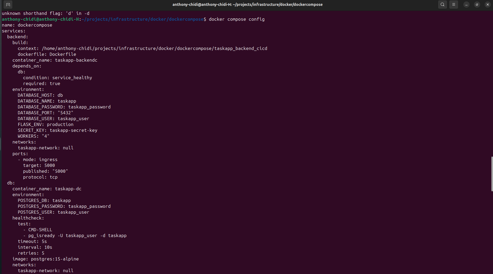
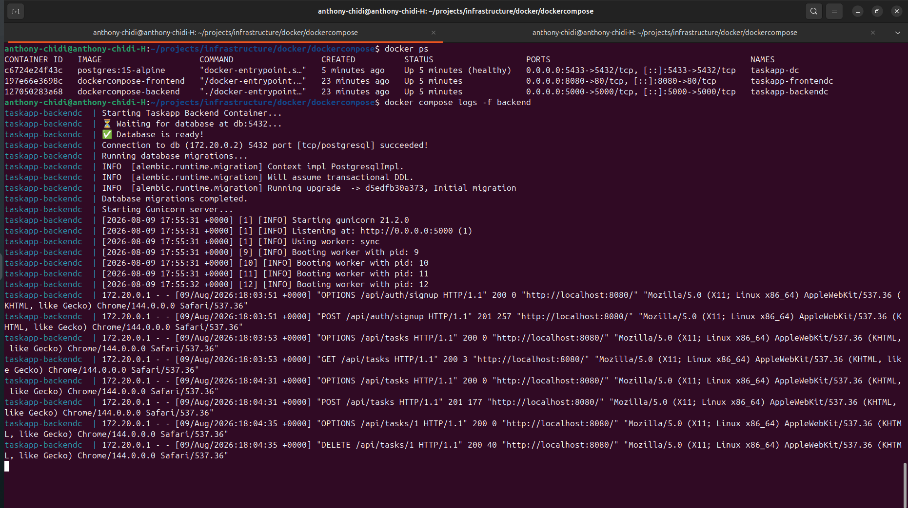
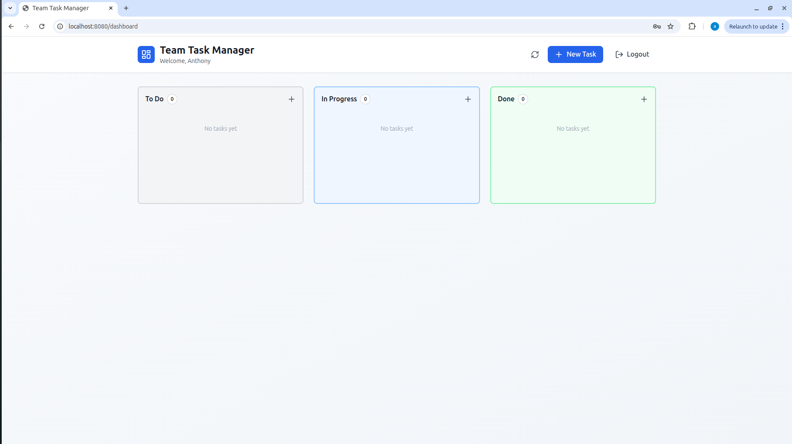
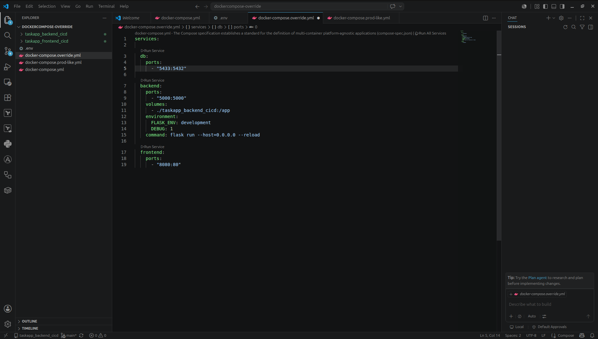

# TaskApp Docker Containerization & Orchestration

A containerized full-stack TaskApp environment implementing Docker-based application packaging, multi-stage image builds, Nginx-based frontend serving, Flask backend containerization, PostgreSQL integration, Docker networking, persistent storage, health checks, and multi-container orchestration with Docker Compose.

## Project Overview

This project packages and orchestrates a full-stack TaskApp application using Docker. The implementation covers the application container lifecycle from image construction and runtime configuration through multi-container orchestration and environment-specific Compose configurations.

### Key Objectives

- Containerize the React frontend using a multi-stage Docker build.
- Serve the production frontend with Nginx.
- Containerize the Flask backend with Gunicorn.
- Run PostgreSQL as a containerized database service.
- Configure service-to-service communication using a custom Docker network.
- Persist PostgreSQL data with a Docker volume.
- Implement database health checks and service dependencies.
- Automate database readiness checks and migrations during backend startup.
- Separate development and production-like Compose behavior.
- Use environment variables for environment-specific configuration.
- Verify the running application through containers, logs, and the browser.

## Architecture

```text
                         ┌─────────────────────┐
                         │       Browser       │
                         │   localhost:8080    │
                         └──────────┬──────────┘
                                    │
                                    ▼
                         ┌─────────────────────┐
                         │      Frontend       │
                         │ React + Nginx       │
                         │     Port 8080       │
                         └──────────┬──────────┘
                                    │
                                    ▼
                         ┌─────────────────────┐
                         │       Backend       │
                         │ Flask + Gunicorn    │
                         │     Port 5000       │
                         └──────────┬──────────┘
                                    │
                                    ▼
                         ┌─────────────────────┐
                         │     PostgreSQL      │
                         │   PostgreSQL 15     │
                         │    Port 5433/5432   │
                         └──────────┬──────────┘
                                    │
                                    ▼
                         ┌─────────────────────┐
                         │   postgres_data     │
                         │   Docker Volume     │
                         └─────────────────────┘

                    Docker Network:
                    taskapp-network
```

The frontend, backend, and database communicate through the custom `taskapp-network` bridge network. PostgreSQL data is persisted through the `postgres_data` Docker volume.

## Technology Stack

| Technology | Purpose |
|---|---|
| Docker | Application containerization |
| Docker Compose | Multi-container orchestration |
| React | Frontend application |
| Nginx | Frontend web server |
| Flask | Backend API |
| Gunicorn | Python application server |
| PostgreSQL | Relational database |
| Alembic | Database migrations |
| Bash | Container startup automation |

## Frontend Containerization

The React frontend uses a two-stage Docker build.

### Build Stage

The application is built using Node.js:

```dockerfile
FROM node:18-alpine AS builder
```

Dependencies are installed and the production frontend bundle is generated:

```dockerfile
RUN npm ci --frozen-lockfile
RUN npm run build
```

Using a separate build stage keeps the Node.js build environment separate from the final runtime image.

### Runtime Stage

The generated assets are served from a lightweight Nginx image:

```dockerfile
FROM nginx:alpine

COPY nginx.conf /etc/nginx/conf.d/default.conf
COPY --from=builder /app/dist /usr/share/nginx/html
```

This separates frontend compilation from production asset serving.

### Nginx Configuration

The Nginx configuration provides:

- Static asset serving
- SPA fallback routing
- Gzip compression
- Long-term caching for static assets
- No-cache behavior for HTML
- A frontend health endpoint

The health endpoint is:

```text
/health
```

and returns:

```text
frontend-healthy
```

## Backend Containerization

The Flask backend is packaged using Python 3.11 Slim:

```dockerfile
FROM python:3.11-slim
```

System dependencies and Python requirements are installed before the application source is copied into the image.

### Non-Root Container Execution

The image creates a dedicated application user:

```dockerfile
RUN useradd -m -u 1000 appuser && chown -R appuser:appuser /app

USER appuser
```

The backend therefore runs as `appuser` rather than the root user.

## Database Readiness and Startup Automation

The backend entrypoint waits for PostgreSQL to become reachable before continuing:

```bash
while ! nc -z $DATABASE_HOST $DATABASE_PORT; do
    sleep 0.1
done
```

Once the database is available, Alembic migrations are executed:

```bash
alembic upgrade head
```

The backend then starts with Gunicorn:

```bash
gunicorn \
    --bind 0.0.0.0:${PORT:-5000} \
    --workers ${WORKERS:-4}
```

### Backend Startup Flow

```text
Container starts
      │
      ▼
Wait for PostgreSQL
      │
      ▼
Database becomes reachable
      │
      ▼
Run Alembic migrations
      │
      ▼
Start Gunicorn
      │
      ▼
Backend API available
```

## PostgreSQL Container

PostgreSQL is deployed using:

```text
postgres:15-alpine
```

The database uses a persistent Docker volume:

```yaml
volumes:
  - postgres_data:/var/lib/postgresql/data
```

This keeps database persistence separate from the lifecycle of the PostgreSQL container.

A Compose health check uses `pg_isready` to determine when the database is ready to accept connections:

```yaml
healthcheck:
  test: ["CMD-SHELL", "pg_isready -U taskapp_user -d taskapp"]
  interval: 10s
  timeout: 5s
  retries: 5
```

## Docker Networking

A custom bridge network is defined:

```yaml
networks:
  taskapp-network:
    driver: bridge
```

The application services are connected to this network. The backend communicates with PostgreSQL through the Compose service name:

```text
DATABASE_HOST=db
```

This allows the backend to reach the database internally without depending on the host machine's database address.

## Docker Compose

Docker Compose defines the complete multi-container application stack:

- PostgreSQL
- Backend
- Frontend
- Custom network
- Persistent database volume
- Database health check
- Service dependencies

### Database Health Check

```yaml
healthcheck:
  test: ["CMD-SHELL", "pg_isready -U taskapp_user -d taskapp"]
  interval: 10s
  timeout: 5s
  retries: 5
```

The backend waits for the database to become healthy:

```yaml
depends_on:
  db:
    condition: service_healthy
```

### Compose Configuration Validation

The Compose configuration was validated using:

```bash
docker compose config
```

The resolved configuration confirms the expected services, build contexts, networking, environment configuration, dependencies, and port mappings.

### Compose Configuration Evidence



## Running the Application Stack

The application can be built and started with:

```bash
docker compose up -d --build
```

Running containers can be inspected with:

```bash
docker ps
```

The resulting environment consists of:

```text
taskapp-dc
    └── PostgreSQL

taskapp-backendc
    └── Flask + Gunicorn :5000

taskapp-frontendc
    └── Nginx :8080
```

## Runtime Verification

The backend runtime output demonstrates:

- PostgreSQL readiness
- Successful database connectivity
- Alembic migration execution
- Gunicorn startup
- Worker processes starting
- API requests reaching the backend

### Backend Runtime Evidence



## Application Verification

The frontend was verified through the browser at:

```text
http://localhost:8080
```

The running application demonstrates that the frontend, backend, and database services are operating together as a containerized application stack.



## Development Configuration

The project includes a Docker Compose override for development workloads.

The development configuration adds:

- Host port mappings
- Backend source-code bind mounting
- Flask development mode
- Debug mode
- Automatic code reload

Example:

```yaml
backend:
  volumes:
    - ./taskapp_backend_cicd:/app
  environment:
    FLASK_ENV: development
    DEBUG: 1
  command: flask run --host=0.0.0.0 --reload
```

This allows the application source code on the host to be mounted into the backend container during development.

### Development Override Evidence



## Production-Like Configuration

A separate production-like Compose configuration is included to demonstrate a more deployment-oriented runtime.

The configuration:

- Removes the database host port binding.
- Binds the backend to localhost.
- Binds the frontend to localhost.
- Removes development source-code volume behavior.
- Uses production Flask settings.
- Configures a smaller Gunicorn worker count.
- Applies CPU and memory resource limits.
- Uses `restart: unless-stopped`.

Example:

```yaml
backend:
  restart: unless-stopped
  ports:
    - "127.0.0.1:5000:5000"
  environment:
    FLASK_ENV: production
    WORKERS: 2
  deploy:
    resources:
      limits:
        cpus: "0.5"
        memory: 512M
```

## Environment Configuration

The project supports environment-specific values through the override configuration.

Sensitive configuration is excluded from version control through `.gitignore`. A safe `.env.example` documents the variables required by the Compose configuration without committing actual secret values.

Example:

```text
DB_PASSWORD=
SECRET_KEY=
VITE_API_URL=
```

## Useful Docker Commands

### Build and start

```bash
docker compose up -d --build
```

### View running containers

```bash
docker ps
```

### View Compose service status

```bash
docker compose ps
```

### Follow backend logs

```bash
docker compose logs -f backend
```

### Enter the backend container

```bash
docker compose exec backend bash
```

### Access PostgreSQL

```bash
docker compose exec db psql -U taskapp_user -d taskapp
```

### Stop the application

```bash
docker compose down
```

### Validate Compose configuration

```bash
docker compose config
```

### Start using the production-like configuration

```bash
docker compose \
  -f docker-compose.yml \
  -f docker-compose.prod-like.yml \
  up -d
```

## Project Structure

```text
taskapp-docker-containerization/
│
├── images/
│   ├── backend-runtime-logs.png
│   ├── development-override.png
│   ├── docker-compose-config.png
│   └── taskapp-running.png
│
├── dockercompose/
│   ├── docker-compose.yml
│   ├── taskapp_backend_cicd/
│   └── taskapp_frontend_cicd/
│
├── dockercompose-override/
│   ├── docker-compose.yml
│   ├── docker-compose.override.yml
│   ├── docker-compose.prod-like.yml
│   ├── taskapp_backend_cicd/
│   └── taskapp_frontend_cicd/
│
├── taskapp_backend_cicd/
│   ├── Dockerfile
│   ├── docker-entrypoint.sh
│   ├── .dockerignore
│   └── ...
│
├── taskapp_frontend_cicd/
│   ├── Dockerfile
│   ├── nginx.conf
│   ├── .dockerignore
│   └── ...
│
├── .gitignore
└── README.md
```

## Key Technical Highlights

- Implemented a multi-stage Docker build for the React frontend.
- Configured Nginx as the frontend runtime server.
- Implemented frontend caching, compression, SPA routing, and a health endpoint.
- Containerized the Flask backend with Python 3.11 Slim.
- Configured the backend to run as a non-root user.
- Automated PostgreSQL readiness checks.
- Automated Alembic database migrations during backend startup.
- Configured Gunicorn as the backend application server.
- Containerized PostgreSQL using PostgreSQL 15 Alpine.
- Implemented persistent database storage with Docker volumes.
- Created a custom Docker bridge network for service communication.
- Implemented Compose health checks and service dependencies.
- Created development and production-like Compose configurations.
- Implemented environment-variable-based configuration.
- Validated the running configuration with `docker compose config`.
- Verified the stack through Docker status, runtime logs, and browser access.

## Project Context

The TaskApp application serves as the workload for this containerization project. The backend and frontend application source originated from existing TaskApp repositories, while this repository focuses on the Docker implementation and infrastructure surrounding the application.

The containerization work covers:

- Dockerfiles
- Multi-stage image builds
- Nginx configuration
- Container startup automation
- Docker networking
- Persistent storage
- Compose orchestration
- Health checks
- Development overrides
- Production-like configuration
- Environment-based configuration
- Runtime verification

## Future Improvements

- Add container vulnerability scanning.
- Automate image builds with GitHub Actions.
- Publish versioned images to a container registry.
- Introduce centralized container logging.
- Add monitoring and metrics collection.
- Improve secret management using Docker secrets or an external secret manager.
- Deploy the containerized application to a cloud environment.
- Explore Kubernetes deployment for larger-scale orchestration.

## Author

**Anthony Chidi**

DevOps / Cloud Engineering Portfolio

[GitHub](https://github.com/chianthony66)
